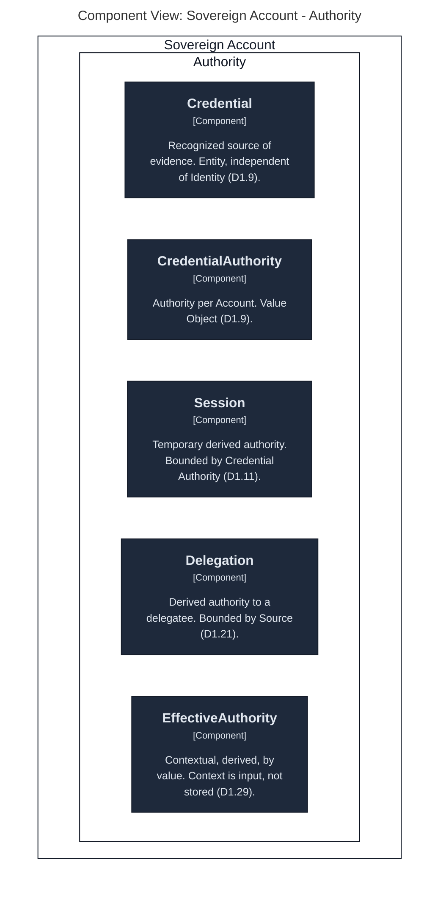
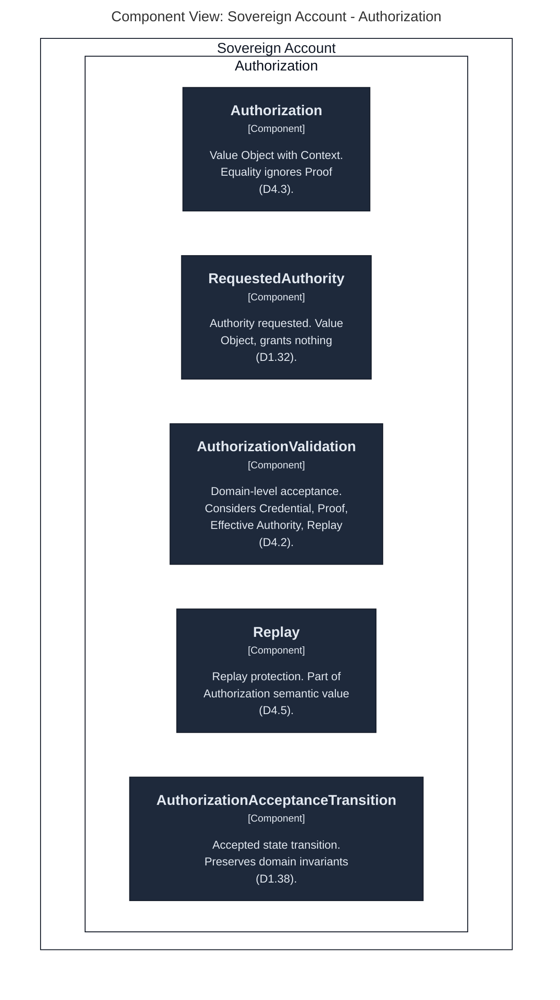
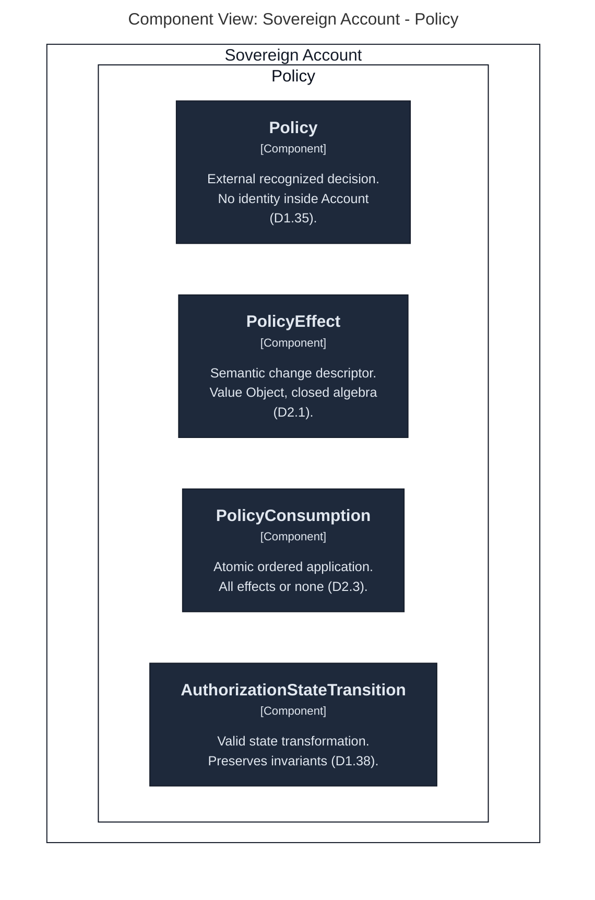
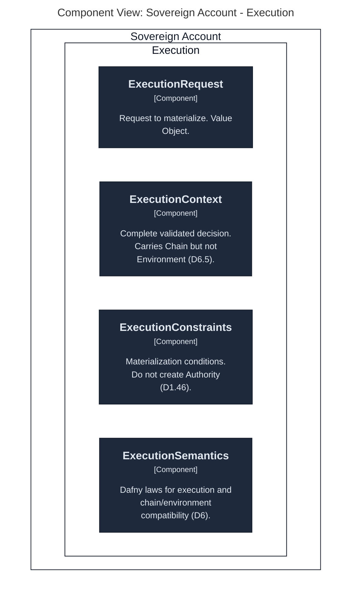

# Formal Laws

The formal invariants of the Account domain, grouped as `D1`–`D6`.

Each file is a self-contained set of laws. Identifiers (`D1.1`, `D1.2`, …) are stable and referenced from the vocabulary and from the Dafny sources.

---

## Laws

| ID | Title | Scope |
|----|-------|-------|
| [D1](D1-delegation-and-authority.md) | Delegation and Authority | Sovereignty, delegation, derived authority, provenance, monotonicity. |
| [D2](D2-policy-effect-and-state.md) | Policy Effect and State | Policy effect algebra, ordered sequences, atomic consumption, contradiction. |
| [D3](D3-entity-identity-and-recognition.md) | Entity Identity and Recognition | Identity immutability, recognition persistence, per-entity lifecycles. |
| [D4](D4-proof-and-authorization-equality.md) | Proof and Authorization Equality | Semantic value of Authorization, exclusion of Proof, Replay Protection. |
| [D5](D5-restriction-association.md) | Restriction Association | Restriction–Capability–Scope mapping, `ModifyRestriction` semantics. |
| [D6](D6-authorization-and-environment.md) | Authorization and Environment | Chain as semantic context, environment-independent acceptance, compatibility at materialization. |

---

## Independence

Each law set is independent of:

- Dafny
- Rust
- EVM
- blockchain addresses
- cryptographic primitives
- storage representations
- implementation-specific data structures

The implementation **must demonstrate** these laws, not redefine them.

---

## Rule

When Dafny finds an ambiguity:

```text
Dafny ambiguity
      ↓
DDD clarification
      ↓
formal law
      ↓
proof
```

Never resolve an ambiguity by introducing a convenient structure in Dafny.

---

## Cross-Reference

Laws reference the vocabulary via `ref:` and cite the original section numbers:

- §1–§6, §44 — Foundations
- §7–§14 — Authority Model
- §15–§19, §42 — Authorization
- §20–§24, §45 — Derived Authority
- §25–§29 — State and Policy
- §30–§43 — Execution Model
- §46–§53 — Reference

---

## Module Diagrams

Per-module component diagrams, rendered from `architecture/workspace.dsl`.

### Foundation

```mermaid
%% kipio-diagram: Foundation
graph TB
  linkStyle default fill:#ffffff

  subgraph diagram ["Component View: Sovereign Account - Foundation"]
    style diagram fill:#ffffff,stroke:#ffffff

    subgraph 10 ["Sovereign Account"]
      style 10 fill:#ffffff,stroke:#151c29,color:#151c29

      subgraph 19 ["Foundation"]
        style 19 fill:#ffffff,stroke:#0a101d,color:#0a101d

        20["<div style='font-weight: bold'>Identity</div><div style='font-size: 70%; margin-top: 0px'>[Component]</div><div style='font-size: 80%; margin-top:10px'>Sovereign continuity. Exactly<br />one per Account (D1.1).</div>"]
        style 20 fill:#1e293b,stroke:#151c29,color:#e2e8f0
        21["<div style='font-weight: bold'>Subject</div><div style='font-size: 70%; margin-top: 0px'>[Component]</div><div style='font-size: 80%; margin-top:10px'>Semantic actor. Value Object.</div>"]
        style 21 fill:#1e293b,stroke:#151c29,color:#e2e8f0
        22["<div style='font-weight: bold'>Capability</div><div style='font-size: 70%; margin-top: 0px'>[Component]</div><div style='font-size: 80%; margin-top:10px'>Faculty by value. No<br />CapabilityId (D1.7).</div>"]
        style 22 fill:#1e293b,stroke:#151c29,color:#e2e8f0
        23["<div style='font-weight: bold'>CapabilityKind</div><div style='font-size: 70%; margin-top: 0px'>[Component]</div><div style='font-size: 80%; margin-top:10px'>Semantic class of a<br />Capability. Value Object.</div>"]
        style 23 fill:#1e293b,stroke:#151c29,color:#e2e8f0
        24["<div style='font-weight: bold'>Delegate</div><div style='font-size: 70%; margin-top: 0px'>[Component]</div><div style='font-size: 80%; margin-top:10px'>Special CapabilityKind.<br />Authorizes the act of<br />delegating (D1.17).</div>"]
        style 24 fill:#1e293b,stroke:#151c29,color:#e2e8f0
        25["<div style='font-weight: bold'>Scope</div><div style='font-size: 70%; margin-top: 0px'>[Component]</div><div style='font-size: 80%; margin-top:10px'>Domain of exercise.<br />Restricts, never expands<br />(D1.42).</div>"]
        style 25 fill:#1e293b,stroke:#151c29,color:#e2e8f0
        26["<div style='font-weight: bold'>Restriction</div><div style='font-size: 70%; margin-top: 0px'>[Component]</div><div style='font-size: 80%; margin-top:10px'>Limit on conditions.<br />Non-expansive (D1.44).</div>"]
        style 26 fill:#1e293b,stroke:#151c29,color:#e2e8f0
        27["<div style='font-weight: bold'>Chain</div><div style='font-size: 70%; margin-top: 0px'>[Component]</div><div style='font-size: 80%; margin-top:10px'>Semantic execution<br />environment. Part of<br />Authorization Context (D6.2).</div>"]
        style 27 fill:#1e293b,stroke:#151c29,color:#e2e8f0
        28["<div style='font-weight: bold'>DomainAction</div><div style='font-size: 70%; margin-top: 0px'>[Component]</div><div style='font-size: 80%; margin-top:10px'>External intent. Belongs to<br />the consumer context.</div>"]
        style 28 fill:#1e293b,stroke:#151c29,color:#e2e8f0
        29["<div style='font-weight: bold'>ExecutionTarget</div><div style='font-size: 70%; margin-top: 0px'>[Component]</div><div style='font-size: 80%; margin-top:10px'>Technical destination.<br />Distinct from Capability<br />Scope (D1.42).</div>"]
        style 29 fill:#1e293b,stroke:#151c29,color:#e2e8f0
      end

    end

  end
```

<!-- architecture:start Foundation -->



<!-- architecture:end -->

### Authority

<!-- architecture:start Authority -->



<!-- architecture:end -->

### Authorization

<!-- architecture:start Authorization -->



<!-- architecture:end -->

### Policy

<!-- architecture:start Policy -->



<!-- architecture:end -->

### Execution

<!-- architecture:start Execution -->



<!-- architecture:end -->
