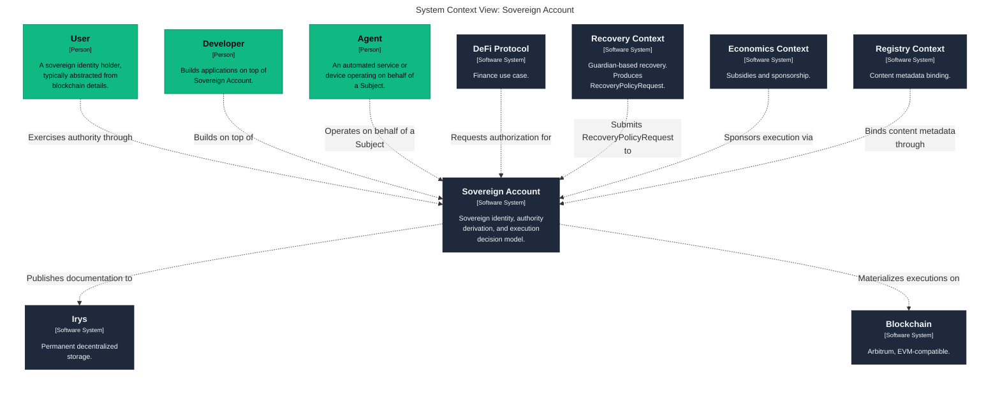
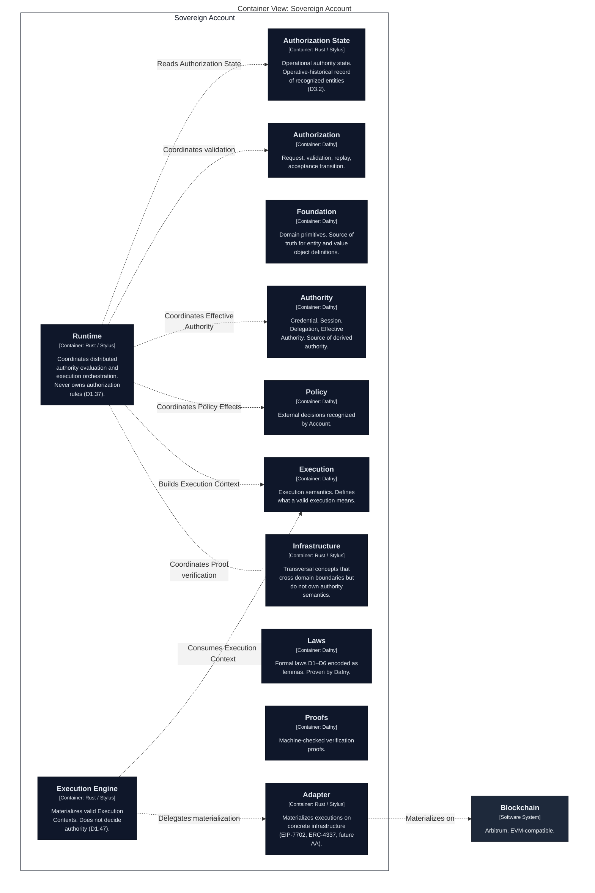

# Ubiquitous Language

The vocabulary of the Account domain.

---

## Chapters

| # | Chapter | Original sections | Description |
| --- | --- | --- | --- |
| 01 | Foundations | §1–§6, §44 | Purpose, external context, Subject, Identity, Account, sovereignty. |
| 02 | Authority Model | §7–§14 | Authority, Capability, Scope, Credential, Credential Authority. |
| 03 | Authorization | §15–§19, §42 | Proof, Verifier, Requested Authority, Authorization, Validation, Replay Protection. |
| 04 | Derived Authority | §20–§24, §45 | Session, Delegation, Delegatee, Restriction, Effective Authority. |
| 05 | State and Policy | §25–§29 | Authorization State, Transitions, Policy, Policy Effect, Policy Consumption. |
| 06 | Execution Model | §30–§43 | Domain Action, Execution Request/Target/Context/Constraints, Runtime, Engine, Adapter. |
| 07 | Reference | §46–§53 | Classification, identifiers, stress test, principles, consolidated model. |

---

## Reading Order

The chapters are ordered by **conceptual dependency**:

```text
01 Foundations
      ↓
02 Authority Model
      ↓
03 Authorization
      ↓
04 Derived Authority
      ↓
05 State and Policy
      ↓
06 Execution Model
      ↓
07 Reference
```

Every chapter may be read independently, but later chapters assume the concepts of earlier ones.

---

## Cross-Reference

- [Formal Laws](../formal-laws/index.md) — the invariants these chapters describe.
- [Glossary](../../../glossary.md) — flat index of all concepts.

---

## Architecture Diagrams

Interactive C4 diagrams, rendered from `architecture/workspace.dsl`.

### System Context

<!-- architecture:start Context -->



<!-- architecture:end -->

### Containers

<!-- architecture:start Containers -->



<!-- architecture:end -->

